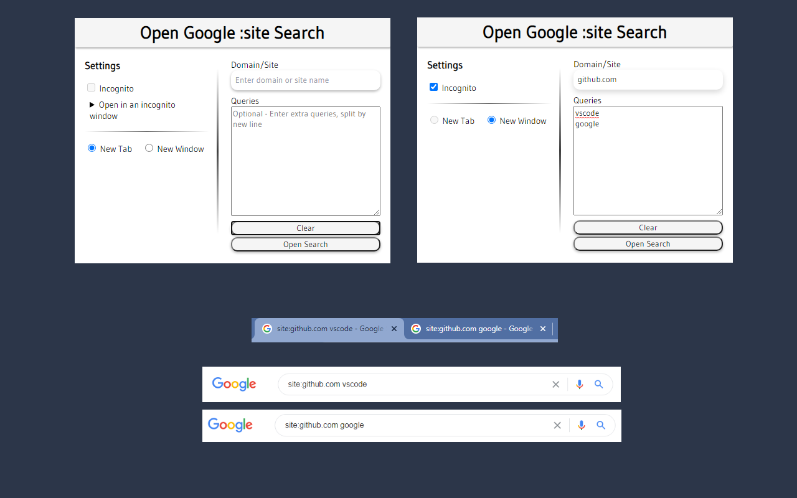

# Search by domain

This extension helps to open google `site:` search with optional queries.

The queries textarea can one or more queries split by new line.

### For example:

- Domain: `github.com`
- Queries: 
    ```
    mendz
    microsoft
    google
    ```

Will open 3 tabs with the searches:
1. `site:github.com mendz`
2. `site:github.com microsoft`
3. `site:github.com google`

### Open in an incognito window
In order to open the tabs in an incognito window, you should:

1. Right-click the extension icon.
2. Click `Manage extensions`.
3. Toggle the `Allow in incognito` option.
4. Use the extension in an incognito window.

### Screenshots


---

Search SVG icon is from: https://heroicons.dev/.